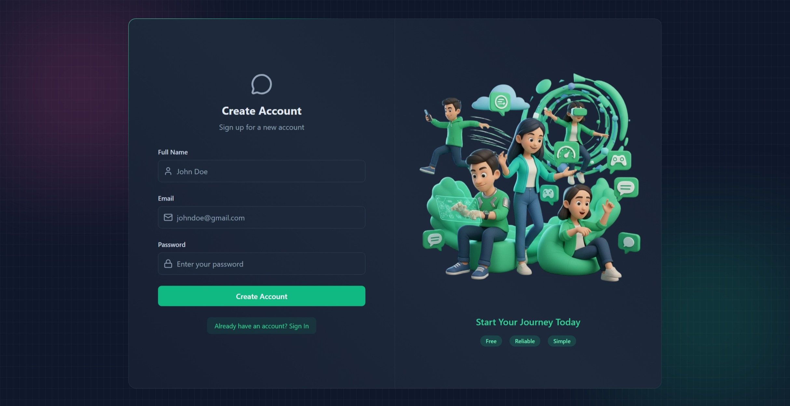
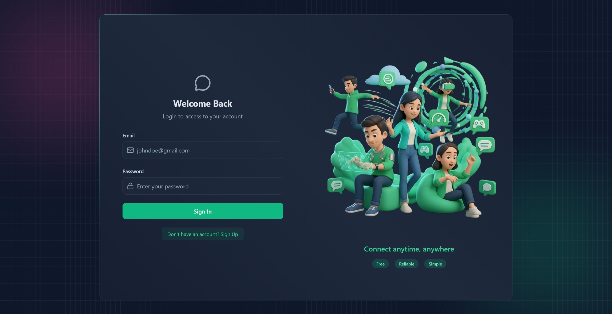
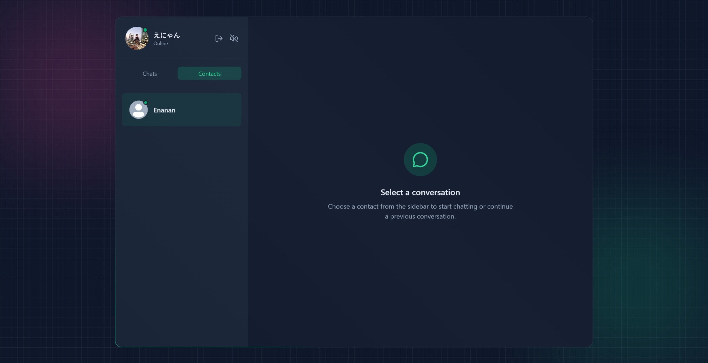
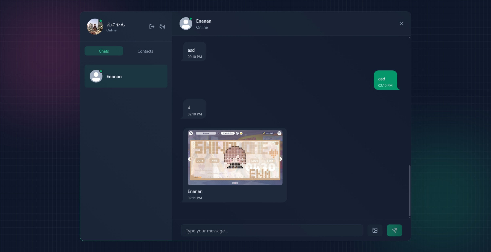

# Realtime Chat App

## Tech Stack
- ReactJS, Express, MongoDB, Socket.io, Zustand, TailwindCSS, DaisyUI

## Screenshots

Here are some screenshots showcasing the application:

|  |  |
|:-------------------------------------------------------------------:|:-------------------------------------------------------------------:|
| **Sign Up Page**                                         | **Sign In Page**                              |

|  |  |
|:-------------------------------------------------------------------:|:-------------------------------------------------------------------:|
| **Home Page**                       | **Chat Window**                           |


## Features

- JWT-based authentication
- Real-time messaging with Optimistic UI
- Image Uploads (Cloudinary)
- Message notifications & typing sounds
- Online user status
- Send welcome email
- Rate-Limiting with Arcjet

## Prerequisites

- [Node.js](https://nodejs.org/) (v20 or higher)

## Installation

1. Clone this repository or download the source code
2. Set up the `.env` file for the backend
3. Open terminal and navigate to the backend directory:

```bash
cd backend
npm install
npm run dev
```

4. Open another terminal and navigate to the frontend directory:

```bash
cd frontend
npm install
npm run dev
```

This will launch the application in your default web browser.